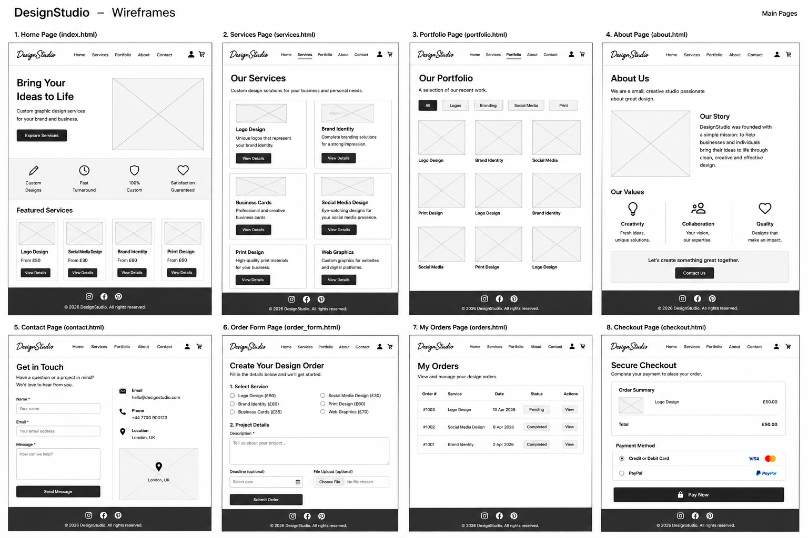

# DesignStudio

## Introduction

DesignStudio is a full-stack Django web application that allows customers to order custom graphic design services online.

Visitors can browse the graphic design services offered and view examples of previous work. Registered users can submit custom design requests based on their individual requirements and manage their orders through their account.

Users can view their submitted orders, including the selected service, project description, price, order status and payment status. They can also edit or delete their orders and proceed to payment using Stripe test payments.

The application is deployed on Heroku and uses a relational database to store application and order data.

## Project Goals

The goal of DesignStudio is to provide a simple online platform connecting customers who need custom graphic design work with a graphic design service provider.

### User Goals

Users should be able to:

- Understand what graphic design services are available.
- View examples of previous design work.
- Register for an account and sign in.
- Submit their own design requirements.
- View their submitted orders.
- Edit or delete their orders.
- See the price, order status and payment status.
- Pay for an order using Stripe test payments.

### Site Owner Goals

The site owner should be able to:

- Advertise graphic design services.
- Showcase previous work.
- Receive custom design orders from customers.
- Accept payments for design services.
- Manage customer orders.
- Generate income through the website.

## Features

### Navigation

The website contains a navigation bar that allows users to access the main areas of the application, including Home, Services and Portfolio.

Authenticated users can also access My Orders and sign out of their account.

### Design Services

The homepage displays the graphic design services available to customers.

Current services include:

- Logo Design
- Poster Design
- Social Media Design

Each service displays a description and starting price.

### Portfolio

The portfolio section allows visitors to view examples of graphic design work.

### User Authentication

Users can create an account and sign in to access the ordering functionality.

Once authenticated, the navigation displays the logged-in username and provides access to the user's orders.

### Create an Order

Registered users can submit a custom design request through the Order a Design feature.

The order is associated with the authenticated user and stored in the application's database.

### My Orders

Authenticated users can access a My Orders page containing their submitted design requests.

Order information includes:

- Design service
- Project description
- Price
- Order status
- Payment status

### Edit and Delete Orders

Users can edit an existing order if they need to change their design requirements.

They can also delete an order they no longer require.

### Stripe Payment

The application includes Stripe integration for test payments.

Users can select Pay Now from their order and proceed through the Stripe test payment process.

## Technologies Used

### Languages

- HTML5 - used to structure the website pages.
- CSS3 - used for custom styling.
- JavaScript - used for interactive functionality.
- Python - used for the application's back-end logic.

### Frameworks and Libraries

- Django - used as the main Python web framework.
- Bootstrap - used to create a responsive layout and user interface.

### Database

- A relational database is used to store users, services and customer order information.

### Other Technologies

- Stripe - used to process test payments.
- Git - used for version control during development.
- GitHub - used to store and manage the project repository.
- Heroku - used to deploy and host the live application.

## Database Design

DesignStudio uses Django models to manage the application's data.

The order system connects each customer order to the authenticated user and the selected graphic design service.

Order information stored by the application includes details such as:

- Customer
- Selected design service
- Project description
- Price
- Order status
- Payment status

This allows each authenticated customer to access and manage their own orders through the My Orders page.

## Testing

The application was manually tested throughout development to ensure that the main functionality works as expected.

### Manual Testing

The following functionality was tested:

| Feature | Test | Result |
| --- | --- | --- |
| Homepage | Homepage loads successfully | Pass |
| Navigation | Navigation links open the correct pages | Pass |
| Registration | A new user can create an account | Pass |
| Login | Registered users can sign in | Pass |
| Logout | Logged-in users can sign out | Pass |
| Services | Available design services and prices are displayed | Pass |
| Portfolio | Portfolio content is displayed | Pass |
| Create Order | Authenticated users can submit a design order | Pass |
| My Orders | Submitted orders appear in the user's My Orders page | Pass |
| Edit Order | Users can edit their existing orders | Pass |
| Delete Order | Users can delete their orders | Pass |
| Order Price | The appropriate service price is stored and displayed | Pass |
| Payment Status | The payment status is displayed with the order | Pass |
| Stripe | Pay Now provides access to the Stripe test payment process | Pass |

### Bugs and Fixes

During development, several issues were encountered and resolved.

One significant issue occurred after deployment when order creation produced a database error in the production environment. The production database schema was corrected and the application was redeployed. After the fix, new orders could be created successfully and appeared correctly in the My Orders page.

Deployment and static file configuration were also adjusted during development to allow the Django application to run correctly on Heroku.

## Deployment

DesignStudio is deployed to Heroku, with the source code stored on GitHub.

### Local Deployment

To run the project locally:

1. Clone the GitHub repository.
2. Open the project directory in a code editor.
3. Create and activate a Python virtual environment.
4. Install the required dependencies:

   pip install -r requirements.txt

5. Configure the required environment variables, including `DJANGO_SECRET_KEY`. Stripe credentials should also be configured through environment variables when payment functionality is being used.
6. Prepare the database by running:

   python manage.py migrate

7. Start the development server:

   python manage.py runserver

### Database

The project uses Django's relational database system. Database migrations are used to create and update the required database tables.

After cloning the project or deploying it to a new environment, migrations should be applied using:

   python manage.py migrate

The application contains custom models for design services and customer design orders, with relationships to Django's User model.

### Heroku Deployment

The application was deployed to Heroku using the following process:

1. Create a Heroku application.
2. Connect the project repository to Heroku.
3. Configure the required environment variables in Heroku Config Vars.
4. Set `DEBUG` to `False` for production.
5. Configure `ALLOWED_HOSTS` for the Heroku application domain.
6. Store `DJANGO_SECRET_KEY` as a Heroku environment variable rather than in the public repository.
7. Add Stripe credentials as environment variables when Stripe payment processing is configured.
8. Ensure `requirements.txt` contains the required Python dependencies.
9. Use the project's `Procfile` to define the Heroku web process.
10. Deploy the `main` branch to Heroku.
11. Run Django database migrations in the deployed environment:

    heroku run python manage.py migrate

12. Verify the deployment using:

    heroku run python manage.py check

Sensitive information such as secret keys and Stripe credentials must not be committed to the public GitHub repository.

### Testing the Deployment

After deployment, the live application should be checked against the development version. Manual testing includes:

- Navigation between pages.
- User registration, login and logout.
- Creating design orders.
- Viewing orders in My Orders.
- Editing and deleting orders.
- Displaying service prices and payment status.
- Testing payment checkout when valid Stripe test credentials are configured.
- Checking successful and cancelled payment feedback.
- Confirming that protected order pages require authentication.
- Confirming that the production Django configuration passes `python manage.py check`.

The purpose of these deployment and testing steps is to ensure that the production application behaves consistently with the development version while keeping sensitive configuration outside the source code.

## Credits

DesignStudio was developed as a full-stack Django project for educational purposes.

### Technologies and Documentation

Documentation for Django, Bootstrap, Stripe, GitHub and Heroku was used during the development and deployment process.

## Wireframes

Wireframes were created to plan the structure, layout and user journey of the DesignStudio application before and during development.

The wireframes cover the main areas of the application, including the home page, services, portfolio, order creation, order management and checkout.

The final application follows the overall structure of the wireframes, although some elements were adapted during development as the functionality of the project evolved.

## Future Improvements

Possible future improvements to DesignStudio include:

- Additional graphic design services.
- More portfolio examples.
- Improved order progress tracking.
- Customer notifications when an order status changes.
- Additional payment and order management features.
- Further improvements to the visual design and user experience.

### Stripe Payment Testing

| Test | Expected Result | Actual Result | Pass |
|---|---|---|---|
| Click Pay Now on an unpaid order | User is redirected to Stripe Checkout | Stripe Checkout opened successfully | Yes |
| Complete payment using Stripe test card | User is redirected to the payment success page and order is marked as paid | Payment completed and order displayed "Payment: Paid" | Yes |
| Cancel Stripe Checkout | User is redirected to the payment cancelled page and is not charged | Payment Cancelled page displayed correctly | Yes |